 [9945571886](https://wa.me/+919945571886){:target="_blank"} |
 [RajkumarAute@Gmail.com](mailto:Rajkumar.Aute@gmail.com){:target="_blank"} |
 [Bangalore](https://en.wikipedia.org/wiki/India){:target="_blank"} |
 [Linkedin](https://www.linkedin.com/in/RajkumarAute/){:target="_blank"} | 
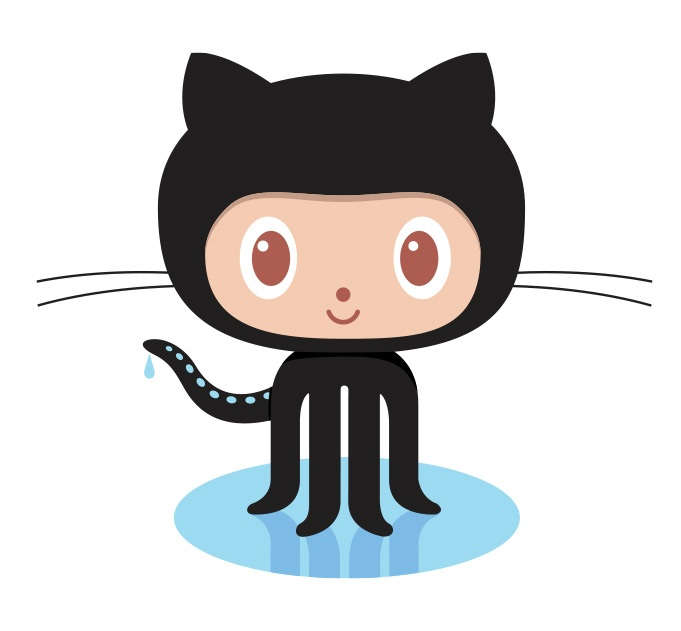 [GitHub](https://github.com/Rajkumar-Aute){:target="_blank"}

#### AWS Architect | DevSecOps | Kubernetes Platform Engineering | Terraform | CI/CD | Forward Deployed Engineering |
> __14+ years of experience__ designing secure, scalable cloud ecosystems. Expert in orchestrating __AWS Elastic Kubernetes Service clusters__, automating CI/CD pipelines (__GitHub Actions__, Jenkins) using __GitOps principles__ (ArgoCD), and provisioning __Infrastructure as Code__ (Terraform). Proven track record of reducing deployment latency by 75%, enforcing Shift-Left security standards, and leading complex cloud modernization initiatives for highly regulated Fortune 500 banking and technology clients.  

___
### Technical Skills
> __Cloud & Platform Engineering:__ EKS, ECS, EC2, Lambda, Fargate, IAM, S3, RDS, VPC, ELB, AutoScaling, EBS, EFS, SSM, Secrets Manager, CloudFront, Route53, Certificate Manager, CloudWatch, CloudTrail, AWS Well-Architected Framework and AWS Landing Zone etc., Azure (AKS), __Kubernetes__, Ingress, Gateway API, IRSA, Pod Identity, External Secrets Operator, Helm, Kustomize, __Terraform__, Terragrunt (IaC), __ArgoCD__.  
__DevSecOps & CyberSecurity:__ GitHub Actions, GitHub Enterprise, Jenkins, tfSec, Checkov, Fortify, SonarQube (SAST), Snyk, Wiz, Contrast Security (DAST), AWS Security Hub, GitHub Advanced Security and Learning Cyber Security.  
__Scripting & Observability:__ Python (Operational Automation), Shell Scripting, Markdown, Prometheus, Grafana.  
__Core Competencies:__ Secure-SDLC, Threat Modeling, Compliance-as-Code, FinOps (Cost Optimization), ITSM, Agile Scrum, Stakeholder Management.

___
### Professional Experience
###  [_Mphasis_](https://www.mphasis.com/){:target="_blank"} _| AWS DevSecOps Architect | Bangalore._ Jan 2025 - Present
> __Forward Deployed Engineering:__ Deploying Mphasis NeoIP applications and code modernization AI tools on Managed Kubernetes clusters for clients. Collaborating with cross-functional teams to design and implement secure, scalable, and highly available private and public cloud environments.  
__Security & Compliance:__ Led the remediation of critical vulnerabilities and legacy Java upgrades across the environment. By leveraging AI LLMs to assist with code refactoring, dramatically reduced the time required to meet internal security compliance metrics.  
__Cross-Project Technical Advisory:__ A consulting SME for external project teams across the organization. Guided their engineers through complex AWS deployments, Kubernetes security hardening, and Terraform best practices to help them resolve architectural roadblocks.  

####  [_IBM_](https://www.ibm.com){:target="_blank"} _| DevSecOps Automation Engineer | Bangalore._ May 2022 - Dec 2024
> __AWS Architect & FinOps:__ Designed highly available, scalable cloud architectures while proactively analyzing and optimizing infrastructure setups to eliminate wasted cloud spend.  
__Enterprise CI/CD Transformation:__ Spearheaded the migration of application and infrastructure pipelines from Jenkins to GitHub Actions. Built reusable workflows with parallel execution and caching that slashed build times from 20 minutes down to 3–5 minutes. Added strict production approval gates, and these workflows were subsequently adopted as the standard across other teams within the organization.  
__EKS Platform Engineering & GitOps:__ Led a massive GitOps transformation by migrating hundreds of micro-apps to AWS EKS. Utilized Terraform and ArgoCD to establish fully automated, drift-proof deployments across multiple environments while managing cluster provisioning and seamless add-on upgrades with minimal downtime.  
__Shift-Left Security Implementation:__ Engineered a strict DevSecOps posture by embedding Fortify (SAST) and Contrast Security (DAST) directly into deployment pipelines to block vulnerabilities before reaching production. Enforced IaC security standards using tfsec and Checkov.  
__Production Operations:__ Took solo responsibility for managing high-stakes production rollouts, ensuring rapid incident recovery and seamless operations.  

####  [_TCS_](http://www.tcs.com){:target="_blank"} _| Cloud DevOps Engineer | Bangalore._ Dec 2020 - May 2022  
>__Cloud Migration:__ Led the large-scale migration of legacy applications from on-premises environments to AWS EKS. Provisioned secure, scalable infrastructure using Terraform and orchestrated deployments via Azure DevOps.  
__Security Auditing & Compliance:__ Drove comprehensive security audits across the platform, successfully remediating critical vulnerabilities. Concurrently streamlined CI/CD pipelines to balance strict security compliance with rapid software delivery.  

#### 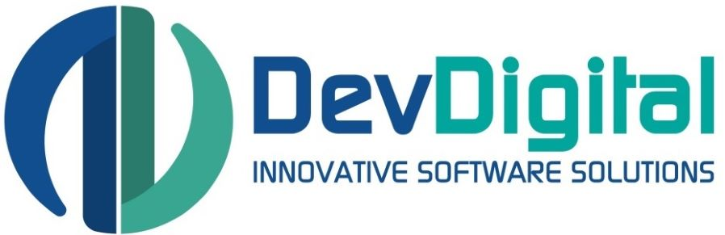 [_DevDigital_](http://www.devdigital.com){:target="_blank"} _| Cloud Architect & DevOps | Remote._ May 2020 - Nov 2020.  
> __Cloud Architecture:__ Architected secure, highly available N-tier cloud infrastructures across AWS and Azure, carefully balancing strict compliance requirements with cost efficiency.  
__Cluster Provisioning:__ Provisioned production-grade EKS clusters from scratch using Terraform, managing all underlying VPC networking, complex IAM integrations, and auto-scaling node groups.  
__Container Orchestration:__ Modernized legacy applications by migrating them into containerized workloads on AWS EKS and ECS, relying on Docker and Terraform to fully automate the deployment lifecycle.  
__Pipeline Development:__ Built end-to-end CI/CD pipelines from the ground up using Jenkins, Buddy.works, and Git to streamline delivery across diverse web hosting environments.  
__High-Availability Web Hosting:__ Engineered resilient, highly available virtual web hosting environments on AWS, deploying and managing multiple large-scale websites utilizing Apache and cPanel.  

#### 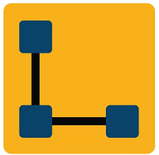 [_Lera Technologies_](http://www.lera.us){:target="_blank"} _| Cloud Devops Engineer | Hyderabad._ Sep 2019 - Apr 2020.  
>__AWS Cloud Administration:__ Managed and maintained a wide range of core AWS services to ensure stable and reliable infrastructure operations.  
__Identity & Infrastructure Management:__ Administered Azure AD integrations, oversaw virtualization environments, and enforced system security protocols.  
__CI/CD Automation:__ Automated the build and deployment lifecycles for Java and Node.js applications by designing reliable CI/CD workflows using Git and Jenkins.  

#### Previous Experience (2012 - 2019)
### [_Wonderla_](http://www.wonderla.com){:target="_blank"} | [_IBM_](http://www.ibm.com){:target="_blank"}  Contracted via  [_3i Infotech_](http://www.3i-infotech.com){:target="_blank"} _ _ , [_Info Services_](http://ibmesp.com){:target="_blank"}, [_Kaizen IT Services_](https://www.linkedin.com/company/kaizen-it-services-pvt.-ltd./){:target="_blank"}
> __Cloud & Database Provisioning:__ Assisted in the design and creation of early cloud infrastructures to host mission-critical billing systems and database servers.  
__Infrastructure & Uptime Management:__ Administered a mixed environment of physical and virtual servers. Achieved and maintained a 98% service uptime for core billing applications hosted across VMware ESXi, Linux, and Windows ADDC environments.  
__Network Operations:__ Managed core network infrastructure including routers, switches, and secure user access protocols to support highly regulated Banking and NBFC (Non-Banking Financial Company) clients.

___
### Certifications
> 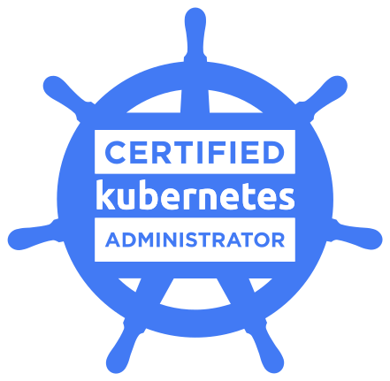 [__Certified Kubernetes Administrator (CKA)__](https://www.credly.com/badges/0dee1521-344c-4602-8f7a-a59983613b8b/public_url){:target="_blank"} | 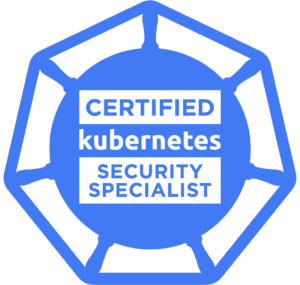 __Certified Kubernetes Security Specialist (CKS)__ ___Certifying___    
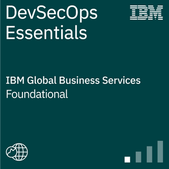 [__IBM DevSecOps Essentials__](https://www.credly.com/badges/e19cb742-c05c-40d8-9d2e-979a92a4fedb/public_url){:target="_blank"}   
 [__Python Essentials from Scaler__](https://moonshot.scaler.com/s/li/YNpxsX_A_c){:target="_blank"} |  [__Python Programming from Skill India Digital Hub__](./image/cert/python%20cert%20skillindia.pdf){:target="_blank"}   
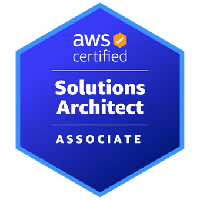 [__AWS Certified Solutions Architect - Associate__](https://www.credly.com/badges/950ba75b-a8e7-4439-836f-d376c0427560?source=linked_in_profile){:target="_blank"}  
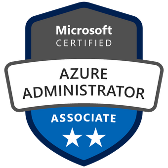 [__Microsoft Certified Azure Administrator Associate__](https://www.credly.com/badges/0ca6c8a7-e631-4a79-8270-bc94404d1705?source=linked_in_profile){:target="_blank"}  
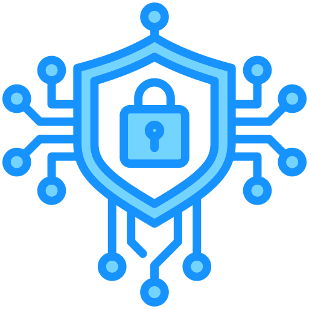 [__Ethical Hacking and Countermeasures Expert__](./image/cert/Rajkumar_Aute_EHCE_Certificate.pdf){:target="_blank"}   
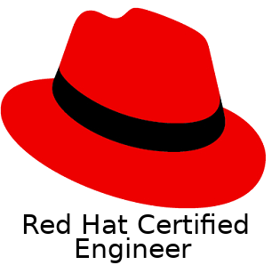 [__Red Hat Certified Engineer__](https://rhtapps.redhat.com/verify?certId=180-084-022){:target="_blank"}  
[__List of other Certifications__](https://www.credly.com/users/rajkumar-aute/){:target="_blank"}  

___
### Honors & Awards
>[IBM](https://www.ibm.com)  ~ _Awarded 5x Star and 1x Super Star_; received client appreciation for exceptional production deployment and automation.  
[TCS](http://www.tcs.com) ~ Achieved [__TCS Gems, Contextual Master__](https://www.tcs.com/tcs-way/contextual-knowledge-mastery-tcs-client-growth){:target="_blank"} Award for sharing Cloud DevOps expertise and driving client project success.  
[WHL](http://www.wonderla.com) ~ Commended by the VP of IT for successfully implementing infrastructure automation.  
<!-- [3i Infotech](http://www.3i-infotech.com) ~ Appreciated by the clients for implementing best practices in IT service.  -->
National-Level Gold Medalist in rifle shooting, NCC Thal Sainik Competition Camp, Delhi (2005) and Best Cadet Award.  

___
### Education
>__PGDCA [Gulbarga University](https://www.gug.ac.in/){:target="_blank"}__ <!--with 62.16% in 2016 -->  
__Bachelor of Commerce [Gulbarga University](https://www.gug.ac.in/){:target="_blank"}__ <!--with 69.84% in 2013 -->  
<!---
__[Karnataka PUE Board Bangalore](https://pue.karnataka.gov.in){:target="_blank"} 10+2__ with 49% in 2009  
__[Karnataka Sec Edu Board](https://sslc.karnataka.gov.in/){:target="_blank"} 10th / SSLC__ with 47.84% in 2005
--->

#### Additional Certifications
>  [__Anthropic Claude 101__](https://verify.skilljar.com/c/ki6g7s6co2d9){:target="_blank"} | 
 [__Anthropic Claude Code 101__](https://verify.skilljar.com/c/zofgbbanxxfs){:target="_blank"} | 
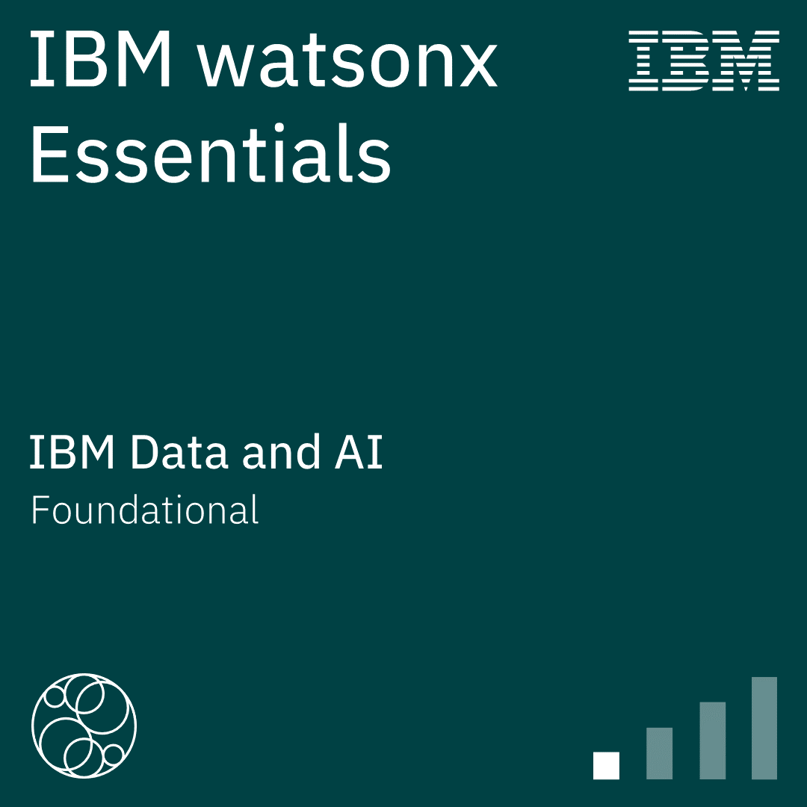 [__IBM Watsonx AI Essentials__](https://www.credly.com/badges/9dc58059-66af-4c0d-ae7a-9f84dd2bc402){:target="_blank"} |
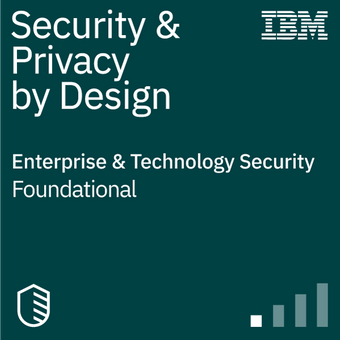 [__Security and Privacy by Design Foundations__](https://www.credly.com/badges/9d566f46-fdc4-4c49-ab6b-270e54da0768){:target="_blank"} | 
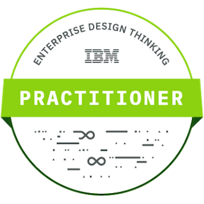 [__Enterprise Design Thinking Practitioner__](https://www.credly.com/badges/9f172c65-e442-43be-b2cb-d07f22c28395){:target="_blank"} | 
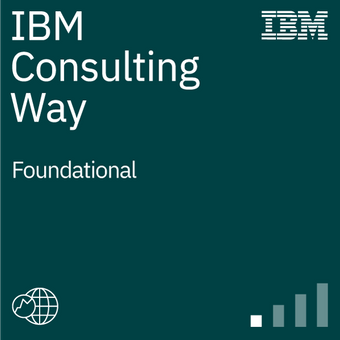 [__IBM Consulting Way Habits__](https://www.credly.com/badges/22a02dc8-4977-4212-866a-4ad290c72438){:target="_blank"} | 
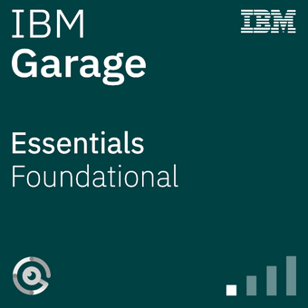 [__IBM Garage Essentials__](https://www.credly.com/badges/93d0e186-5352-44bb-9d57-8400d5dd14aa){:target="_blank"} | 
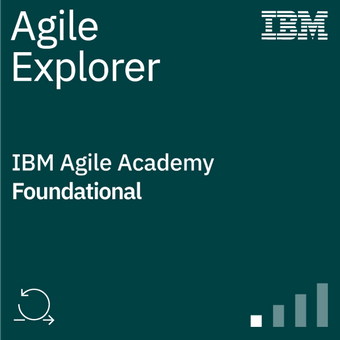 [__IBM Agile Explorer__](https://www.credly.com/badges/c3e6edb8-0874-4a87-8013-b8858b78f153){:target="_blank"} | 
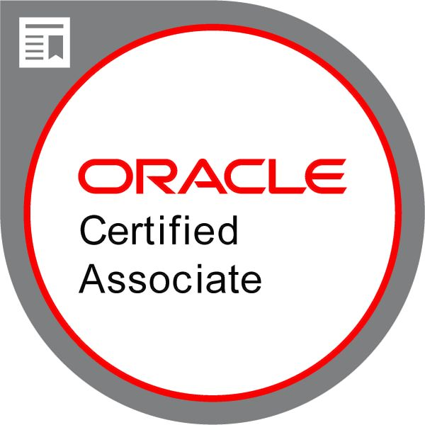 [__Oracle Cloud Infrastructure__](https://www.credly.com/badges/93d0e186-5352-44bb-9d57-8400d5dd14aa){:target="_blank"}
